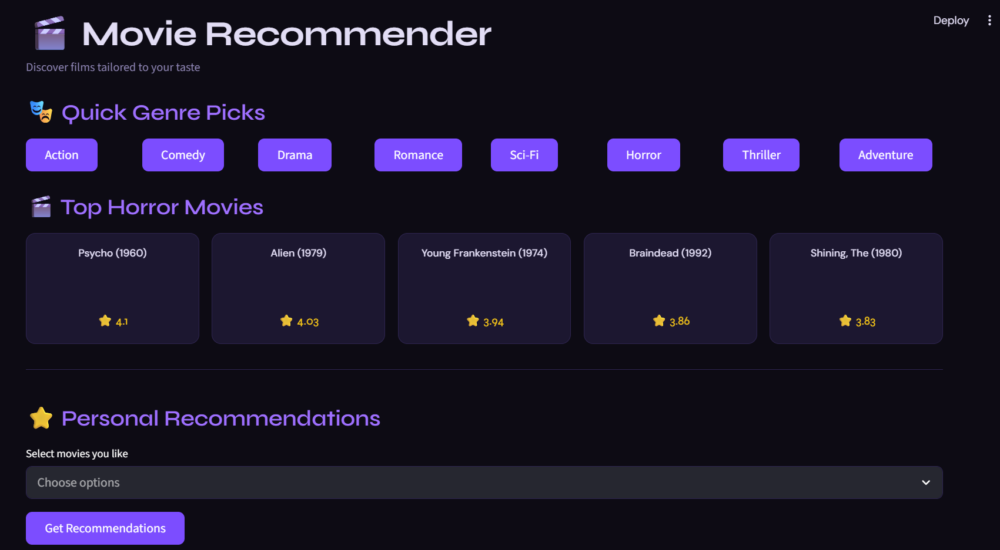
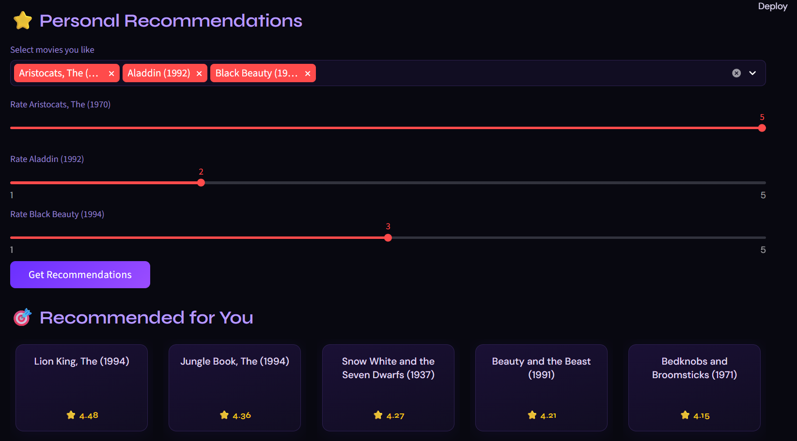

# 🎬 Hybrid Movie Recommender System

This is a project for the subject Artificial Intelligence under KJSCE Academic Year 2025-2026. 
An interactive movie recommendation system built using Python and Streamlit, with content-based filtering to deliver personalized suggestions.

## 🚀 Features

- 🎭 **Genre-based Quick Picks**
  - Instantly browse top-rated movies by genre

- 🧠 **Content-Based Filtering**
  - Uses cosine similarity between movies
  - Recommends similar movies based on user preferences

## 🧰 Tech Stack

- Python 3.10
- Pandas, NumPy
- Scikit-learn
- Streamlit
- Surprise
- LightFM

## 📂 Dataset

Uses the **MovieLens 100K Dataset**:

Download here:  
https://grouplens.org/datasets/movielens/100k/

After downloading, extract into: data/

## 📸 Preview

### 🎭 Genre Recommendations

### ⭐ Personalized Recommendations

